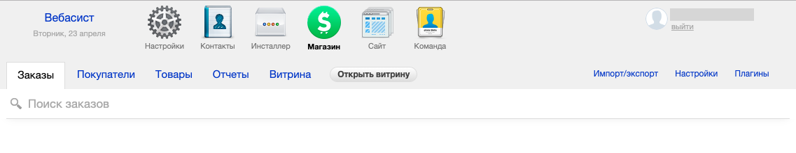
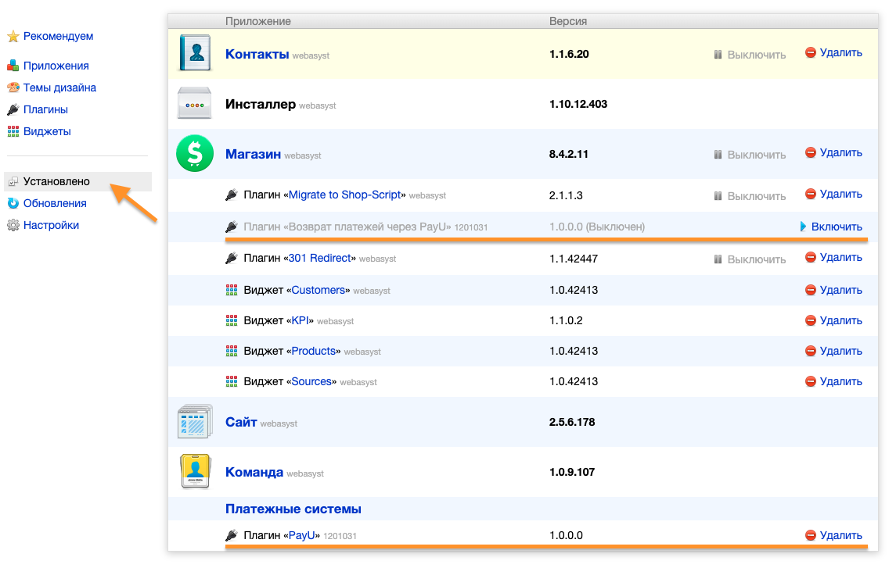
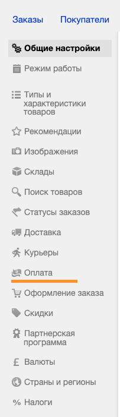
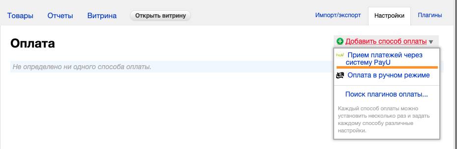
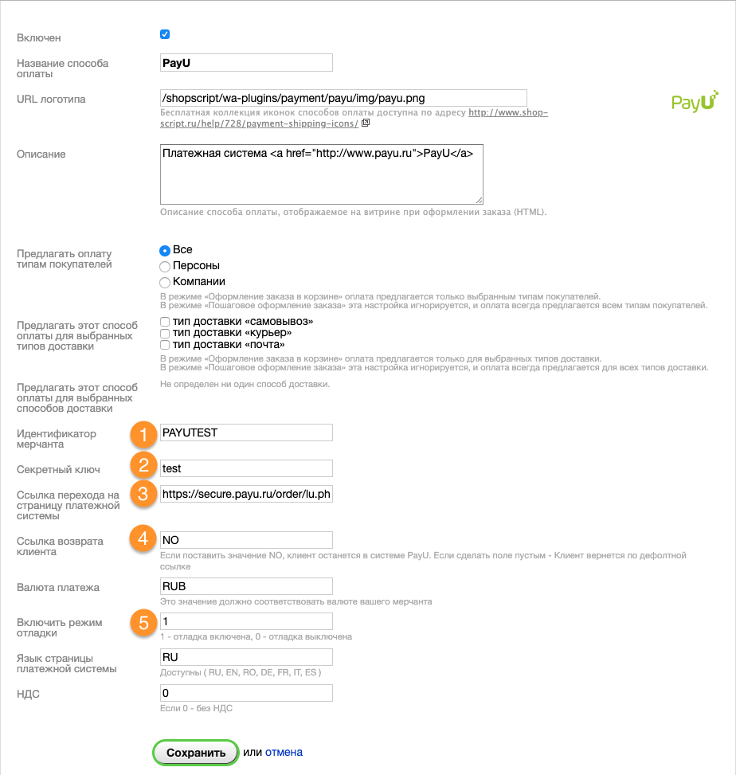

# Плагин для Webasyst Shop-Script 8

## Установка плагина с помощью “Инсталлера“



Для установки плагина на сайт необходимо зайти в пункт меню “Инсталлер”, и с помощью поиска найти и установить плагин **«PayU»**. Так же, если необходим функционал для выполнения возвратов по проведенным платежам, необходимо найти и установить плагин **«Получение статусов платежей PayU»**. После установки плагина необходимо выполнить его настройку.

## Ручная установка плагина

Для самостоятельной установки плагинов приема платежей и возврата платежей через систему PayU, необходимо скачать архив из репозитория расположенного на [Github](https://github.com/payuru/Webasyst-Shop-script-8). Распаковать архив. И скопировать содержимое папки в корневой каталог Shop-Script. Структура каталогов архива полностью соответствует требованиям размещения плагинов для Shop-Script 8.

После копирования плагинов, необходимо перейти в меню “Инсталлер” и в левом меню выбрать пункт “Установлено”.



Плагин приема платежей активируется автоматически. Плагин для возврата платежей необходимо включить вручную.

## Настройка плагина приема платежей

После установки плагина приема платежей, необходимо выполнить его настройку. Для настройки плагина необходимо зайти в меню **“Магазин”**, затем в правой части экрана выбрать пункт **“Настройки”**


На открывшейся странице настроек в левом меню выбирите пункт **“Оплата”**



На открывшейся странице в левом углу расположен пункт **“Добавить способ оплаты”**. При нажатии на этот пункт появится меню в котором необходимо выбрать **“Прием платежей через систему PayU”**



После выбора вы попадете на страницу настроек плагина:



Для правильной работы плагина с системой PayU, необходимо заполнить следующие поля:

1. **Идентификатор мерчанта** - идентификатор который можно найти в личном кабинете мерчанта в системе PayU.
2. **Секретный ключ** - можно найти в личном кабинете мерчанта в системе PayU.
3. **Ссылка перехода на страницу платежной системы** - адрес сервера для работы с системой PayU. По умолчанию - https://secure.payu.ru/order/lu.php
4. **Ссылка возврата клиента** - если установить пустое значение, то после проведения платежа будет выполнен переход на страницу магазина. Если установлено значение «NO», то после проведения платежа покупатель останется на странице сервиса PayU. Так же можно установить свой адрес страницы успешной оплаты.
5. **Включить режим отладки** - для проведения тестовых платежей необходимо установить значение равным 1. Для работы с реальными платежами необходимо установить значение - 0.

После внесения всех настроек необходимо сохранить внесенные изменения.

## Настройка плагина для получения статусов платежей

Для получения статусов платежей на сайте магазина не нужно проводить настройку. Для того чтоб заказы получали сообщения о процессе проведения платежа, необходимо провести настройку личного кабинета мерчанта в системе PayU.

Для этого необходимо в настройках личного кабинета установить IPN адрес магазина, например:

```<http://{ваш домен}/payments.php/payu_statuses/?transaction_result=result>```

